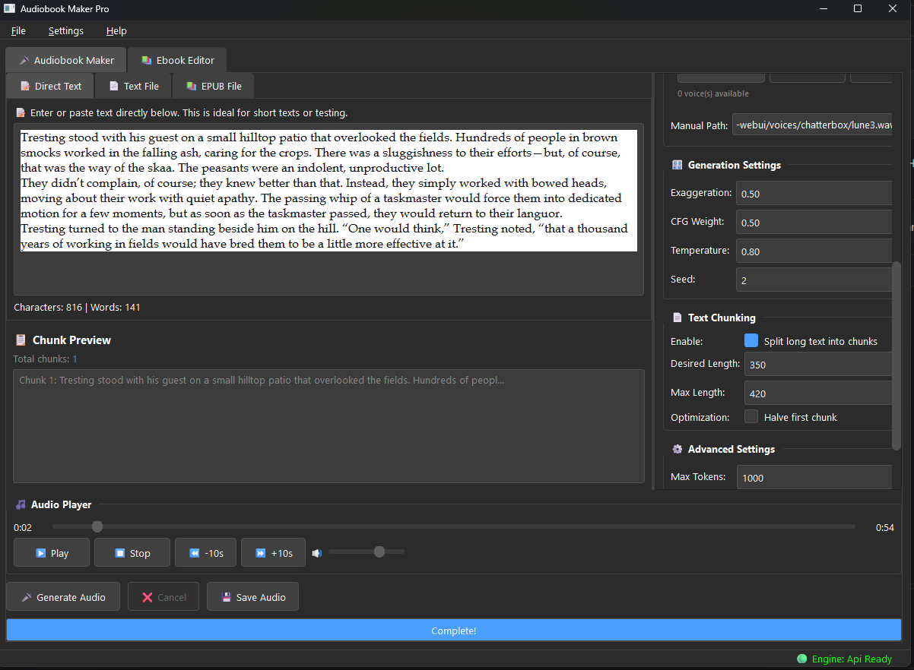

# Audiobook Maker Pro

A professional desktop application for converting text to audiobooks using local or remote TTS (Text-to-Speech) technology.


## Features

- 🏠 **Local Chatterbox TTS** - Run TTS directly without external server
- 🌐 **Remote API Support** - Connect to TTS-WebUI servers
- 📁 **Multiple Input Formats** - TXT, PDF, EPUB support
- 🎤 **Voice Management** - Easy voice reference handling
- ⚙️ **Advanced Settings** - Full control over TTS parameters
- 💾 **Preset System** - Save and load your favorite settings
- 📚 **Ebook Editor** - Built-in chapter extraction and editing
- 🎵 **Audio Player** - Preview generated audio instantly

## Quick demo (MP4)

[](https://raw.githubusercontent.com/D3voz/audiobook-maker-pro/main/media/videos/demo-basic.mp4)

## Screenshot


## Installation

### Prerequisites

- Python 3.10 or 3.11
- CUDA-capable GPU (recommended) or CPU
- Windows 10/11, Linux, or macOS

### Quick Start

1. **Clone the repository**
   ```bash
   git clone https://github.com/YOUR_USERNAME/audiobook-maker-pro.git
   cd audiobook-maker-pro
2. **Install dependencies**
   ```bash
   pip install -r requirements.txt
   pip install torch==2.6.0 torchvision==0.21.0 torchaudio==2.6.0 --index-url https://download.pytorch.org/whl/cu124

3. **Run the application**
   ```bash
   python main.py


Usage

Local Mode (Built-in TTS)

-Select "Local Chatterbox" in the Engine settings
-Choose a voice reference file (optional)
-Enter your text or load a file
-Click "Generate Audio"
-Models will download automatically on first use

API Mode (Recomended) (tts-webui server) 

-Start tts-webui
-There Tools-Activate API
-Select "API Server" in the Engine settings of Audiobook Maker Pro
-Done

```bash
On 4060ti- Local Mode speed- avg 37it/sec . tts-webui API speed- avg - 80it/sec

API mode is recommended as rsxdalv/TTS-WebUI (https://github.com/rsxdalv/TTS-WebUI) has 2x or more speed than my direct Local mode. 

Acknowledgments
-Chatterbox - TTS engine
-TTS-WebUI (https://github.com/rsxdalv/TTS-WebUI) - API compatibility