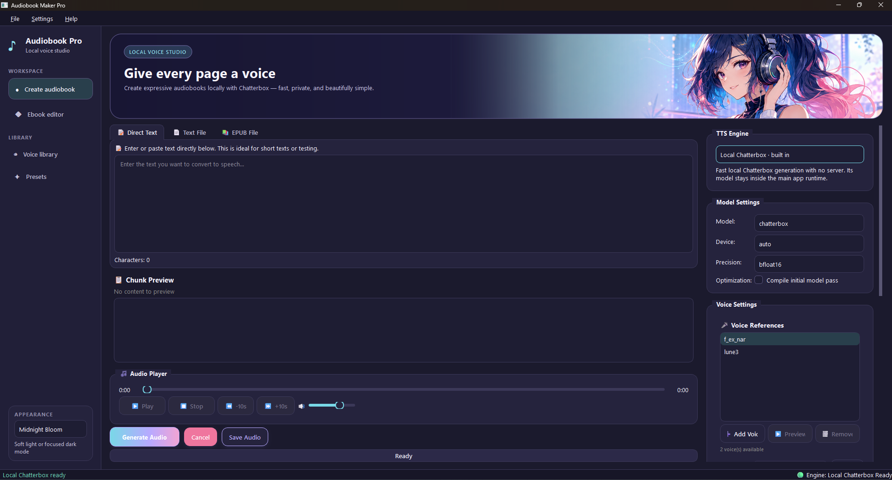
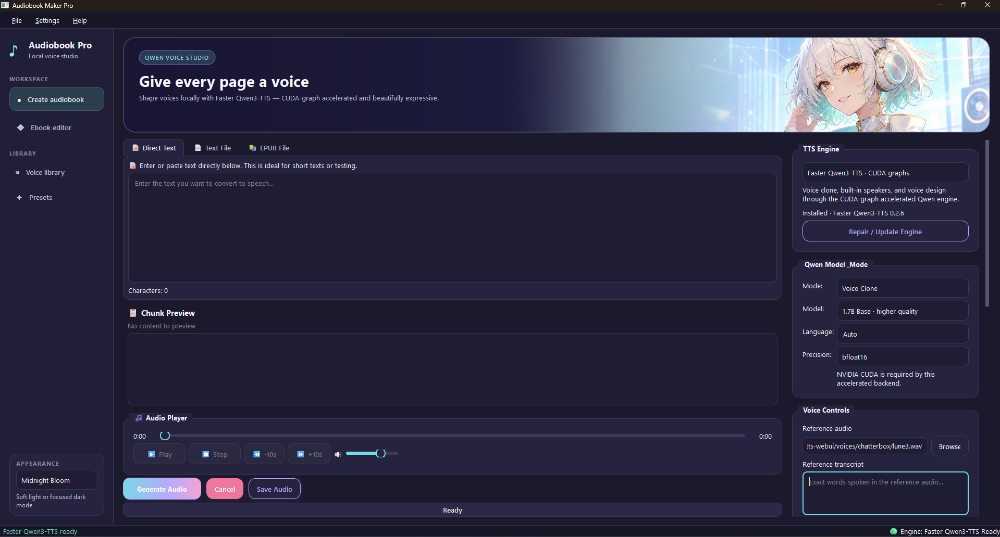

# Audiobook Maker Pro

A desktop application for turning text, PDF, and EPUB content into audiobooks with fast, local TTS engines.

## Features

- Fast local Chatterbox inference without a TTS-WebUI server
- Faster Qwen3-TTS with CUDA graphs, voice cloning, built-in speakers, and voice design
- English and multilingual Chatterbox models
- Voice-reference management
- TXT, PDF, and EPUB input
- Built-in ebook chapter editor and audio preview
- Aurora Daydream and Midnight Bloom interface themes
- Optional remote TTS-WebUI API compatibility

## Interface showcase

The interface adapts its artwork and settings to the selected speech engine while keeping the audiobook workflow in one workspace.

<details open>
<summary><strong>Local Chatterbox · Midnight Bloom</strong></summary>



</details>

<details open>
<summary><strong>Faster Qwen3-TTS · Midnight Bloom</strong></summary>



</details>

## Requirements

- Python 3.10 or 3.11
- Windows 10/11, Linux, or macOS
- An NVIDIA CUDA GPU is strongly recommended for audiobook generation

## Installation

Create and activate a virtual environment first:

```powershell
python -m venv .venv
.\.venv\Scripts\Activate.ps1
python -m pip install --upgrade pip
```

For an NVIDIA GPU, install the same PyTorch generation used by the current TTS-WebUI setup:

```powershell
python -m pip install torch==2.11.0 torchvision==0.26.0 torchaudio==2.11.0 --index-url https://download.pytorch.org/whl/cu128
```

Then install the application:

```powershell
python -m pip install -r requirements.txt
python main.py
```

For CPU, macOS, AMD, or Intel GPU installation commands, use the [PyTorch installation selector](https://pytorch.org/get-started/locally/) before installing `requirements.txt`.

### Updating an existing installation

Older versions of this repository installed a different package under the `chatterbox-tts` name. Remove both possible distributions once, then reinstall so that shared `chatterbox` module files cannot overlap:

```powershell
python -m pip uninstall -y chatterbox-tts tts-webui.chatterbox-tts
python -m pip install -r requirements.txt
```

## Usage

### Local mode (recommended)

1. Select **Local Chatterbox (Direct)**.
2. Choose `chatterbox` or `multilingual`, a precision, and an optional voice reference.
3. Enter text or open a supported file.
4. Generate the audio.

Local CUDA generation uses the optimized Chatterbox 0.4.4 inference package and its manual CUDA-graph token backend - the same performance path used by the TTS-WebUI Chatterbox extension. TTS-WebUI itself is not imported or required. The first generation can take longer while CUDA graphs and caches are prepared; later chunks reuse them.

### API mode (optional)

Use API mode only when you want to generate on another machine or keep compatibility with an existing TTS-WebUI server. Activate its OpenAI-compatible API and use the default endpoint, `http://localhost:7778/v1`, or enter a remote endpoint.

### Faster Qwen3-TTS (optional)

Qwen is intentionally installed in a separate managed environment so its PyTorch and audio dependencies cannot replace the versions used by Chatterbox.

1. Select **Faster Qwen3-TTS** in the TTS Engine panel.
2. Click **Install Engine** and let the background installation finish.
3. Choose one of the Qwen modes:
   - **Voice Clone** uses a reference recording and transcript. Speaker-embedding-only mode makes the transcript optional and is useful for language switching.
   - **Built-in Voice** uses Qwen speakers such as Ryan, Vivian, or Serena and accepts an optional delivery instruction.
   - **Voice Design** creates a voice from a written description.
4. Generate audio. The selected model downloads from Hugging Face on first use and is reused from the normal Hugging Face cache afterward.

The accelerated `torch` backend in Faster Qwen3-TTS requires an NVIDIA CUDA GPU. Its model remains loaded in a persistent worker process, so CUDA graphs and voice prompts are reused across audiobook chunks. The optional runtime is stored under the operating system's local application-data directory, not inside the project virtual environment.

## Acknowledgements

- [Chatterbox](https://github.com/resemble-ai/chatterbox) by Resemble AI
- [TTS-WebUI Chatterbox performance fork](https://github.com/rsxdalv/chatterbox)
- [TTS-WebUI](https://github.com/rsxdalv/TTS-WebUI) for API compatibility
- [Faster Qwen3-TTS](https://github.com/andimarafioti/faster-qwen3-tts) by Andres Marafioti
- [Qwen3-TTS](https://github.com/QwenLM/Qwen3-TTS) by the Qwen team
